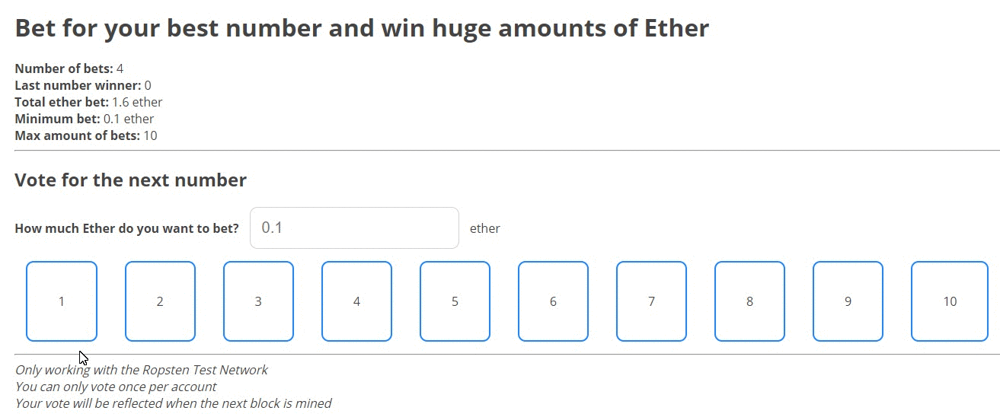
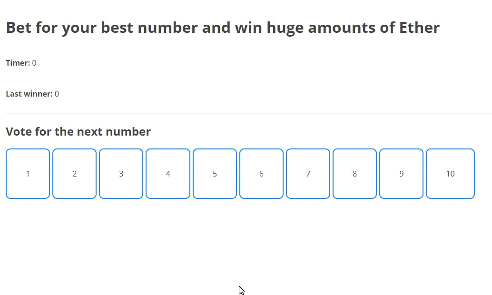
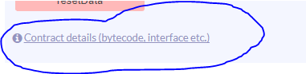
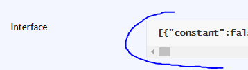

# dApp en IPFS con Metamask
> Este tutorial es resumen y una traducción de [The ultimate end-to-end tutorial to create and deploy a fully decentralized Dapp in ethereum](https://medium.com/ethereum-developers/the-ultimate-end-to-end-tutorial-to-create-and-deploy-a-fully-descentralized-dapp-in-ethereum-18f0cf6d7e0e "The ultimate end-to-end tutorial to create and deploy a fully decentralized Dapp in ethereum")
***
Así es como queda:


Este tutorial es la visión entera de crear un Smart Contract, conectarlo todo y tener una dapp final que incluya hosting descentralizado con IPFS.
***
Los conocimientos básicos a tratar son:
* Como crear un Smart Contract desde cero
* Como desplegar ese Smart Contract en Ropsten
* Como crear el frontend de la dApp
* Como conectar el contrato desplegado con la aplicación
* Como desplegar la dApp en el hosting descentralizado de IPFS
* Como usar dominios de IPFS personalizados
***
La tecnología que vamos a usar es:
* __Database:__ blockchain de Ethereum, Tesnet Ropsten
* __Hosting:__ IPFS ==> free hosting para siempre
* __Frontend:__ React.js con webpack
* __Domain name:__ Godaddy (se puede cambiar por uno descentralizado como peername)
* __Contract's programming language:__ Solidity 0.4.11
* __Frontend contracts:__ web3.js para usar el SmartContract en la interfaz web del usuario
* __Frameworks:__ Truffle para desplegar, test y compilar nuestro contrato
* __Development server:__ Node.js para usar la app mientras desarrollamos localmente con testrpc
* __Metamask:__ para la parte final de uso del usuario
***
Los pasos a  seguir son:
1. Preparar el proyecto
2. Programar el contrato en Solidity
3. Crear el frontend de la aplicación
4. Despliegue online con IPFS
5. Usar un dominio personalizado para la aplicación
6. Jugar con la dApp final!!

***

# 1. Preparar el proyecto
* Descarga la versión actualizada de node.js desde [Web oficial Node.org](https://nodejs.org/en/ "Web oficial de Nodejs")  
Desde terminal:  
1. Crea una carpeta llamada:  
`mkdir casino-ethereum`
2. Ejecuta npm:  
`npm init -y`
3. Despues, instala truffle:  
`npm i -D -g truffle`
4. Crea los archivos necesarios para node:  
`npm init -y`
5. Crea los archivos necesarios para truffle:  
`truffle init`
6. Después las herramientas para el frontend (nota: versión de web3: 0.20):  
`npm i -D webpack react react-dom babel-core babel-loader babel-preset-react babel-preset-env css-loader style-loader json-loader web3@0.20.0`
7. Instalamos un servidor ligero (nota: localhost:8080):  
`npm i -g http-server`
8. Crea un archivo (nota: combinado con todo el js y el css forma `buld.js`):  
`webpack.config.js`
	1. Escribe:  
```
const path = require('path')
module.exports = {

   entry: path.join(__dirname, 'src/js', 'index.js'), // Our frontend will be inside the src folder  
   output: {  
      path: path.join(__dirname, 'dist'),  
      filename: 'build.js' // The final file will be created in dist/build.js  
   },  
   module: {  
      rules: [{  
         test: /\.css$/, // To load the css in react  
         use: ['style-loader', 'css-loader'],  
         include: /src/  
      }, {  
         test: /\.jsx?$/, // To load the js and jsx files  
         loader: 'babel-loader',  
         exclude: /node_modules/,  
         query: {  
            presets: ['es2015', 'react', 'stage-2']  
         }  
      }]  
   }  
}
```
9. Después crea una carpeta:  
`mkdir src`
	1. Dentro, crea:   
	`mkdir js`
		1. Dentro, crea:  
		`index.js`
	2. Y: 
	`mkdir css`
		1. Dentro, crea:  
		`index.css`
10. Por último:  
`mkdir dist`
	1. Dentro, crea:  
	`index.html`
* La estructura debe quedar así:
```shell
contracts/
-- Migrations.sol
migrations/
node_modules/
test/
src/
-- css/index.css
-- js/index.js
dist/
-- index.html
package.json 
truffle-config.js
truffle.js
webpack.config.js
```
11. Dentro de `index.html`escribe:
```html
<!DOCTYPE html>
<html lang="en">
<head>
   <meta charset="UTF-8">
   <meta name="viewport" content="width=device-width, initial-scale=1.0">
   <link href='https://fonts.googleapis.com/css?family=Open+Sans:400,700' rel='stylesheet' type='text/css'>
   <title>Casino Ethereum Dapp</title>
</head>
<body>
   <div id="root"></div>

   <script src="build.js"></script>
</body>
</html>
```
12. Dentro de `contracts/` crea:  
`Casino.sol`

***

# 2. Programar los contratos en Solidity
1. Dentro de `contracts/Casino.sol`escribe (versión actualizada en [Github del Autor](https://github.com/merlox/casino-ethereum/blob/master/contracts/Casino.sol "Github del autor")
```js
pragma solidity ^0.4.11;

import "github.com/oraclize/ethereum-api/oraclizeAPI.sol";

/// @title Contract to bet Ether for a number and win randomly when the number of bets is met.
/// @author Merunas Grincalaitis
contract Casino is usingOraclize {
   address owner;

   // The minimum bet a user has to make to participate in the game
   uint public minimumBet = 100 finney; // Equal to 0.1 ether

   // The total amount of Ether bet for this current game
   uint public totalBet;

   // The total number of bets the users have made
   uint public numberOfBets;

   // The maximum amount of bets can be made for each game
   uint public maxAmountOfBets = 10;

   // The max amount of bets that cannot be exceeded to avoid excessive gas consumption
   // when distributing the prizes and restarting the game
   uint public constant LIMIT_AMOUNT_BETS = 100;

   // The number that won the last game
   uint public numberWinner;

   // Array of players
   address[] public players;

   // Each number has an array of players. Associate each number with a bunch of players
   mapping(uint => address[]) numberBetPlayers;

   // The number that each player has bet for
   mapping(address => uint) playerBetsNumber;

   // Modifier to only allow the execution of functions when the bets are completed
   modifier onEndGame(){
      if(numberOfBets >= maxAmountOfBets) _;
   }

   /// @notice Constructor that's used to configure the minimum bet per game and the max amount of bets
   /// @param _minimumBet The minimum bet that each user has to make in order to participate in the game
   /// @param _maxAmountOfBets The max amount of bets that are required for each game
   function Casino(uint _minimumBet, uint _maxAmountOfBets){
      owner = msg.sender;

      if(_minimumBet > 0) minimumBet = _minimumBet;
      if(_maxAmountOfBets > 0 && _maxAmountOfBets <= LIMIT_AMOUNT_BETS)
         maxAmountOfBets = _maxAmountOfBets;

      // Set the proof of oraclize in order to make secure random number generations
      oraclize_setProof(proofType_Ledger);
   }

   /// @notice Check if a player exists in the current game
   /// @param player The address of the player to check
   /// @return bool Returns true is it exists or false if it doesn't
   function checkPlayerExists(address player) returns(bool){
      if(playerBetsNumber[player] > 0)
         return true;
      else
         return false;
   }

   /// @notice To bet for a number by sending Ether
   /// @param numberToBet The number that the player wants to bet for. Must be between 1 and 10 both inclusive
   function bet(uint numberToBet) payable{

      // Check that the max amount of bets hasn't been met yet
      assert(numberOfBets < maxAmountOfBets);

      // Check that the player doesn't exists
      assert(checkPlayerExists(msg.sender) == false);

      // Check that the number to bet is within the range
      assert(numberToBet >= 1 && numberToBet <= 10);

      // Check that the amount paid is bigger or equal the minimum bet
      assert(msg.value >= minimumBet);

      // Set the number bet for that player
      playerBetsNumber[msg.sender] = numberToBet;

      // The player msg.sender has bet for that number
      numberBetPlayers[numberToBet].push(msg.sender);

      numberOfBets += 1;
      totalBet += msg.value;

      if(numberOfBets >= maxAmountOfBets) generateNumberWinner();
   }

   /// @notice Generates a random number between 1 and 10 both inclusive.
   /// Must be payable because oraclize needs gas to generate a random number.
   /// Can only be executed when the game ends.
   function generateNumberWinner() payable onEndGame {
      uint numberRandomBytes = 7;
      uint delay = 0;
      uint callbackGas = 200000;

      bytes32 queryId = oraclize_newRandomDSQuery(delay, numberRandomBytes, callbackGas);
   }

   /// @notice Callback function that gets called by oraclize when the random number is generated
   /// @param _queryId The query id that was generated to proofVerify
   /// @param _result String that contains the number generated
   /// @param _proof A string with a proof code to verify the authenticity of the number generation
   function __callback(
      bytes32 _queryId,
      string _result,
      bytes _proof
   ) oraclize_randomDS_proofVerify(_queryId, _result, _proof) onEndGame {

      // Checks that the sender of this callback was in fact oraclize
      assert(msg.sender == oraclize_cbAddress());

      numberWinner = (uint(sha3(_result))%10+1);
      distributePrizes();
   }

   /// @notice Sends the corresponding Ether to each winner then deletes all the
   /// players for the next game and resets the `totalBet` and `numberOfBets`
   function distributePrizes() onEndGame {
      uint winnerEtherAmount = totalBet / numberBetPlayers[numberWinner].length; // How much each winner gets

      // Loop through all the winners to send the corresponding prize for each one
      for(uint i = 0; i < numberBetPlayers[numberWinner].length; i++){
         numberBetPlayers[numberWinner][i].transfer(winnerEtherAmount);
      }

      // Delete all the players for each number
      for(uint j = 1; j <= 10; j++){
         numberBetPlayers[j].length = 0;
      }

      totalBet = 0;
      numberOfBets = 0;
   }
}
```
2. Ahora creamos un nuevo archivo en la carpeta `migrations`para añadir allí los valores que el constructor de nuestro contrato recibirá:  `2_deploy_contracts.js`

3. Deberemos poner algo así:
```
var Casino = artifacts.require("./Casino.sol");

module.exports = function(deployer) {
  deployer.deploy(web3.toWei(0.1, 'ether'), 100, {gas: 3000000});
};
```
4. Finalmente podemos desplegar el contrato usando Truffle o Remix vamos a la carpeta del proyecto y ejecutamos el comando:
`truffle compile`  
> Recuerda copiar el address del contrato para usarlo después

***

# 3. Crear el frontend de la aplicación
1. Abre `index.js` y escribe:
```js
import React from 'react'
import ReactDOM from 'react-dom'
import Web3 from 'web3'
import './../css/index.css'

class App extends React.Component {
   constructor(props){
      super(props)
      this.state = {
         lastWinner: 0,
         timer: 0
      }
   }

voteNumber(number){
      console.log(number)
   }

render(){
      return (
         <div className="main-container">
            <h1>Bet for your best number and win huge amounts of Ether</h1>

<div className="block">
               <h4>Timer:</h4> &nbsp;
               <span ref="timer"> {this.state.timer}</span>
            </div>

<div className="block">
               <h4>Last winner:</h4> &nbsp;
               <span ref="last-winner">{this.state.lastWinner}</span>
            </div>

<hr/>

<h2>Vote for the next number</h2>
            <ul>
               <li onClick={() => {this.voteNumber(1)}}>1</li>
               <li onClick={() => {this.voteNumber(2)}}>2</li>
               <li onClick={() => {this.voteNumber(3)}}>3</li>
               <li onClick={() => {this.voteNumber(4)}}>4</li>
               <li onClick={() => {this.voteNumber(5)}}>5</li>
               <li onClick={() => {this.voteNumber(6)}}>6</li>
               <li onClick={() => {this.voteNumber(7)}}>7</li>
               <li onClick={() => {this.voteNumber(8)}}>8</li>
               <li onClick={() => {this.voteNumber(9)}}>9</li>
               <li onClick={() => {this.voteNumber(10)}}>10</li>
            </ul>
         </div>
      )
   }
}

ReactDOM.render(
   <App />,
   document.querySelector('#root')
)
```
2. Ahora lo mismo con el index.css:
```css
body{
    font-family: 'open sans';
    margin: 0;
}
ul{
    list-style-type: none;
    padding-left: 0;
    display: flex;
}
li{
    padding: 40px;
    border: 2px solid rgb(30,134,255);
    margin-right: 5px;
    border-radius: 10px;
    cursor: pointer;
}
li:hover{
    background-color: rgb(30,134,255);
    color: white;
}
li:active{
    opacity: 0.7;
}
*{
   color: #444444;
}
.main-container{
   padding: 20px;
}
.block{
   display: flex;
   align-items: center;
}
.number-selected{
   background-color: rgb(30,134,255);
   color: white;
}
.bet-input{
   padding: 15px;
   border-radius: 10px;
   border: 1px solid lightgrey;
   font-size: 15pt;
   margin: 0 10px;
}
```
* Combinados deben verse así:  
  

3. Despliega en Remix, y abre los detalles del contrato:  
  
	1. Copia la interfaz ABI:  
	  
> Doble click para copiar el texto completo  
4. Ahora ve a `index.js` y pega lo siguiente en el constructor:  
```js
constructor(props){
   super(props)
   this.state = {
      lastWinner: 0,
      numberOfBets: 0,
      minimumBet: 0,
      totalBet: 0,
      maxAmountOfBets: 0,
   }

   if(typeof web3 != 'undefined'){
      console.log("Using web3 detected from external source like Metamask")
      this.web3 = new Web3(web3.currentProvider)
   }else{
      this.web3 = new Web3(new Web3.providers.HttpProvider("http://localhost:8545"))
   }

   const MyContract = web3.eth.contract([here goes the ABI interface])

   this.state.ContractInstance = MyContract.at("0x925d81c01d878899adbb7d38f84ce9d5284fa2e7")
}
```
Esto es lo que hace:
* Primero crea el constructor y da el `state`inicial de la aplicación
* Entonces comprueba si la variable `Web3`que hemos importado está definida o no. Web3 está definida cuando utilidades como Metamask inyectan su web3.
* Configuré el contrato ABI para que la aplicación sepa qué funciones están disponibles para este contrato.
* Finalmente configuré la dirección del contrato con `MyContract.at ()`. Guardé la instancia en el `state` como una propiedad llamada `ContractInstance`, pero lo importante es saber que __MyContract.at () devuelve la instancia__.

* El código final del frontend quedaría algo así:
```js
import React from 'react'
import ReactDOM from 'react-dom'
import Web3 from 'web3'
import './../css/index.css'

class App extends React.Component {
   constructor(props){
      super(props)
      this.state = {
         lastWinner: 0,
         numberOfBets: 0,
         minimumBet: 0,
         totalBet: 0,
         maxAmountOfBets: 0,
      }

if(typeof web3 != 'undefined'){
         console.log("Using web3 detected from external source like Metamask")
         this.web3 = new Web3(web3.currentProvider)
      }else{
         console.log("No web3 detected. Falling back to http://localhost:8545. You should remove this fallback when you deploy live, as it's inherently insecure. Consider switching to Metamask for development. More info here: http://truffleframework.com/tutorials/truffle-and-metamask");
         this.web3 = new Web3(new Web3.providers.HttpProvider("http://localhost:8545"))
      }

const MyContract = web3.eth.contract([{"constant":false,"inputs":[],"name":"generateNumberWinner","outputs":[],"payable":false,"type":"function"},{"constant":true,"inputs":[],"name":"numberOfBets","outputs":[{"name":"","type":"uint256"}],"payable":false,"type":"function"},{"constant":false,"inputs":[{"name":"player","type":"address"}],"name":"checkPlayerExists","outputs":[{"name":"","type":"bool"}],"payable":false,"type":"function"},{"constant":false,"inputs":[],"name":"kill","outputs":[],"payable":false,"type":"function"},{"constant":false,"inputs":[],"name":"resetData","outputs":[],"payable":false,"type":"function"},{"constant":false,"inputs":[{"name":"maxBets","type":"uint256"}],"name":"setMaxAmountOfBets","outputs":[],"payable":false,"type":"function"},{"constant":false,"inputs":[{"name":"number","type":"uint256"}],"name":"bet","outputs":[],"payable":true,"type":"function"},{"constant":false,"inputs":[],"name":"distributePrizes","outputs":[],"payable":false,"type":"function"},{"constant":true,"inputs":[],"name":"numberWinner","outputs":[{"name":"","type":"uint256"}],"payable":false,"type":"function"},{"constant":true,"inputs":[],"name":"minimumBet","outputs":[{"name":"","type":"uint256"}],"payable":false,"type":"function"},{"constant":true,"inputs":[],"name":"maxAmountOfBets","outputs":[{"name":"","type":"uint256"}],"payable":false,"type":"function"},{"constant":true,"inputs":[{"name":"","type":"uint256"}],"name":"players","outputs":[{"name":"","type":"address"}],"payable":false,"type":"function"},{"constant":true,"inputs":[],"name":"totalBet","outputs":[{"name":"","type":"uint256"}],"payable":false,"type":"function"},{"inputs":[{"name":"_minimumBet","type":"uint256"},{"name":"_maxAmountOfBets","type":"uint256"}],"payable":false,"type":"constructor"},{"payable":true,"type":"fallback"}])
      this.state.ContractInstance = MyContract.at("0x7a684de06f473636e03e2d951c78d190eeecb411")
   }

componentDidMount(){
      this.updateState()
      this.setupListeners()

setInterval(this.updateState.bind(this), 10e3)
   }

updateState(){
      this.state.ContractInstance.minimumBet((err, result) => {
         if(result != null){
            this.setState({
               minimumBet: parseFloat(web3.fromWei(result, 'ether'))
            })
         }
      })
      this.state.ContractInstance.totalBet((err, result) => {
         if(result != null){
            this.setState({
               totalBet: parseFloat(web3.fromWei(result, 'ether'))
            })
         }
      })
      this.state.ContractInstance.numberOfBets((err, result) => {
         if(result != null){
            this.setState({
               numberOfBets: parseInt(result)
            })
         }
      })
      this.state.ContractInstance.maxAmountOfBets((err, result) => {
         if(result != null){
            this.setState({
               maxAmountOfBets: parseInt(result)
            })
         }
      })
   }

// Listen for events and executes the voteNumber method
   setupListeners(){
      let liNodes = this.refs.numbers.querySelectorAll('li')
      liNodes.forEach(number => {
         number.addEventListener('click', event => {
            event.target.className = 'number-selected'
            this.voteNumber(parseInt(event.target.innerHTML), done => {

// Remove the other number selected
               for(let i = 0; i < liNodes.length; i++){
                  liNodes[i].className = ''
               }
            })
         })
      })
   }

voteNumber(number, cb){
      let bet = this.refs['ether-bet'].value

if(!bet) bet = 0.1

if(parseFloat(bet) < this.state.minimumBet){
         alert('You must bet more than the minimum')
         cb()
      } else {
         this.state.ContractInstance.bet(number, {
            gas: 300000,
            from: web3.eth.accounts[0],
            value: web3.toWei(bet, 'ether')
         }, (err, result) => {
            cb()
         })
      }
   }

render(){
      return (
         <div className="main-container">
            <h1>Bet for your best number and win huge amounts of Ether</h1>

<div className="block">
               <b>Number of bets:</b> &nbsp;
               <span>{this.state.numberOfBets}</span>
            </div>

<div className="block">
               <b>Last number winner:</b> &nbsp;
               <span>{this.state.lastWinner}</span>
            </div>

<div className="block">
               <b>Total ether bet:</b> &nbsp;
               <span>{this.state.totalBet} ether</span>
            </div>

<div className="block">
               <b>Minimum bet:</b> &nbsp;
               <span>{this.state.minimumBet} ether</span>
            </div>

<div className="block">
               <b>Max amount of bets:</b> &nbsp;
               <span>{this.state.maxAmountOfBets} ether</span>
            </div>

<hr/>

<h2>Vote for the next number</h2>

<label>
               <b>How much Ether do you want to bet? <input className="bet-input" ref="ether-bet" type="number" placeholder={this.state.minimumBet}/></b> ether
               <br/>
            </label>

   <ul ref="numbers">
               <li>1</li>
               <li>2</li>
               <li>3</li>
               <li>4</li>
               <li>5</li>
               <li>6</li>
               <li>7</li>
               <li>8</li>
               <li>9</li>
               <li>10</li>
            </ul>
         </div>
      )
   }
}

ReactDOM.render(
   <App />,
   document.querySelector('#root')
)
```

***

# 4. Desplegar la aplicación con IPFS
Ahora la aplicación está completa, es tiempo de moverlo a mundo online descentralizado con IPFS  
1. Instala IPFS de su web:  
[web de IPFS](https://ipfs.io/docs/install/ "Web de IPFS")  
> Nota: si usas Windows, debes añadir la carpeta al `path`, para poder leerlo desde cualquier parte  
2. Después de instalarlo,crea un nodo, ejecutando desde la terminal:  
`ipfs daemon`
3. En otra terminal, permite a tus _peers_ compartir tu contenido:  
`ipfs swarm peers`
4. Luego añade tu carpeta `dist` a la red:  
`ipfs add -r dist/`
* Aparecerá algo así, el último es el identificador único de tu carpeta:
```
added Qmc9HzLPur2ncuUArLjAaa4t2HrXFycgjUPb6122N6tzi2 dist/build.js
added QmZBaGYWsACJ5aCFhW459xHZ8hk4YazX1EQFiSenu3ANfR dist/index.html
added QmfZoCnPcgmHYmFJqHBcyuFh3FEYrTZqGdGyioSMrAZzw2 dist
```
5. Copia el último hash, y ejecuta:  
`ipfs name publish <HashArchivo>`
* Eso te dará algo así:  
`Published to QmRDVed784YwKrYAgiiBbh2rFGfCUemXWk3NkD7nWdstER: /ipfs/QmfZoCnPcgmHYmFJqHBcyuFh3FEYrTZqGdGyioSMrAZzw2`  
* Esto dice que tu contenido está disponible en la 1º url. Puedes comprobarlo èn el navegador con:  
`gateway.ipfs.io/ipns/<TuHashAquí>` es decir, en este caso:  
`gateway.ipfs.io/ipns/QmRDVed784YwKrYAgiiBbh2rFGfCUemXWk3NkD7nWdstER`  
> Al hacer cambios en el archivo recuerda ejecutar `webpack` luego `ipfs add -r dist/` y `ipfs name publish <el hash>`

***

# 5. Usar dominio personalizado
1. Ve al _DNS manager_ de tu dominio en godaddy (similar en otros proveedores)
2. Añade un nuevo _TXT record_ con _Host_: @ y _Value_:  
`dnslink=/ipns/<TuHash>`
3. Salva y cambia o apunta al _gateway.ipfs.io’s original IP_ añade una _A record_ con _Host_: @ _Pointing to_:
`217.182.195.23`
4. Borra cualquier otro _A records_ porque causará interferencias con esto último
5. Salva, y tras varias minutos comprueba que el dominio está funcionando
6. También puede acceder a él yendo a: `getaway.ipfs.io/ipns/<TuDominio>
* En este caso, las direcciones URL son `gateway.ipfs.io/peppo.es` y `peppo.es`

***

# 6. A Jugar!!
